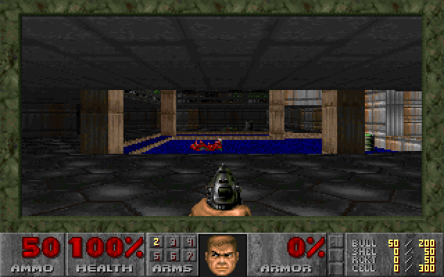
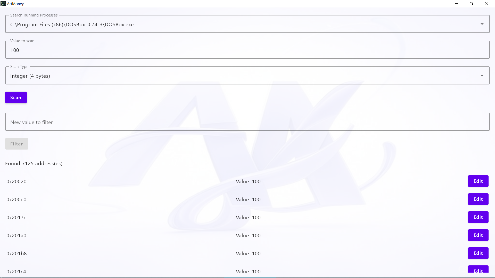
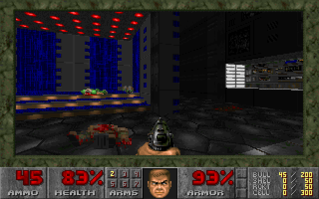
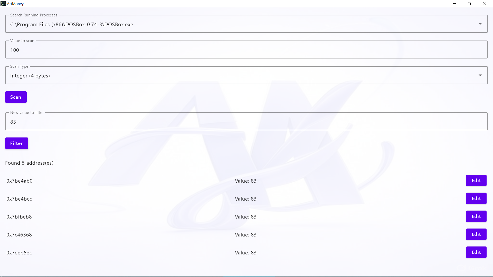
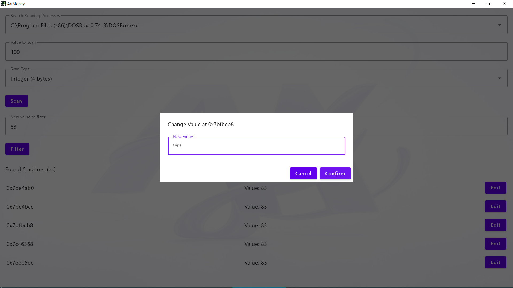
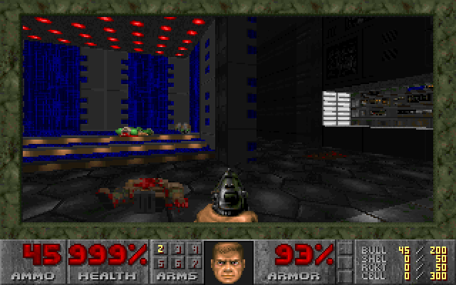

#   ArtMoney

A **powerful memory editing tool** built with **Kotlin Multiplatform**, enabling users to scan and modify values in a program's memory effortlessly. Supports both **PC (Windows)** and **Android (Root Required)**.

## 🚀 Features
- ✅ **Cross-platform** – Works on **Windows** and **rooted Android**  
- ✅ **List Running Processes** – Identify all active processes
- ✅ **Supports Multiple Data Types** – Scan for **Integer, Float, Long, Double, and String**  
- ✅ **Scan for Target Values** – Locate specific memory addresses (e.g., `Health = 100`)
- ✅ **Filter Results** – Refines candidate addresses by tracking changes (e.g., `100` → `83`)
- ✅ **Modify Memory** – Modifies memory address values (e.g., setting health to `999`)
- ✅ **Optimized Searches** – Utilizes **Boyer-Moore algorithm** for ultra-fast value searching
- ✅ **Lightning-Fast Performance**: **Scans only readable memory regions**, avoiding scanning each individual page

## 📸 Screenshots

  
  
  
  
  
  

## 🛠️ Tech Stack
- [**MVVM Architecture**](https://www.geeksforgeeks.org/mvvm-model-view-viewmodel-architecture-pattern-in-android/) - Organizes code for better separation of concerns.
- [**Compose Multiplatform**](https://developer.android.com/jetpack/compose) - Declarative UI framework for Android, Desktop, and beyond.
- [**Kotlin Multiplatform**](https://kotlinlang.org/docs/multiplatform.html) - Enables seamless code sharing between Android and PC.
- [**Koin**](https://insert-koin.io/) - Lightweight dependency injection framework for Kotlin.
- [**JNA (Java Native Access)**](https://github.com/java-native-access/jna) - Access to native system libraries like `libc` on Android.
- [**JNA Platform**](https://github.com/java-native-access/jna) - Provides Java bindings for `Win32` API on Windows.

## 🎮 Usage Walkthrough (e.g., `doom`)
- 1️⃣ **Select a Process** – Pick a game or app from the active process list.
- 2️⃣ **Scan Memory** – Input a target value (e.g., `100` for health).
- 3️⃣ **Modify the Value** – In the game, take an action that changes the value (e.g., take damage so health drops to `83`).
- 4️⃣ **(Optional) Filter Addresses** – Perform another scan to filter addresses that match the new value (e.g., `83`).
- 5️⃣ **Adjust the Address Value** – Change the identified value (e.g., modify `83` → `999`).
- 6️⃣ **Verify Changes** – Check if the modification is reflected in the game!

## 📥 Installation
1. Import the project into **Android Studio**.
2. Follow this guide under section **"Run your application"** to configure and run the application on Windows:
   [Compose Multiplatform Guide](https://www.jetbrains.com/help/kotlin-multiplatform-dev/compose-multiplatform-create-first-app.html#run-your-application)
   📌 **Root access required!** If running on **Android**, ensure the device is **rooted**.

## ⚠️ Important Notes
- 🔄 **Address Refresh Behavior:** Clicking on an address **refreshes its value** automatically.
- ❌ **String Refresh Limitation:** String values cannot be refreshed because length must **predefine** before reading.
- 💻 **PC Buffer Size:** When reading an entire memory region in one call, the data is copied to a buffer.
- 📱 **Android Buffer Size Limitations:** Large buffer allocations cause crashes, so memory regions are divided into small chunks to avoid issues.
- 🔒 **Root Required:** If the Android device is **not rooted**, only ArtMoney itself appears in the process list.

## 🤝 Contributing
🚀 PRs & contributions are welcome!  
📬 **Got ideas?** Open an issue or reach out!  

